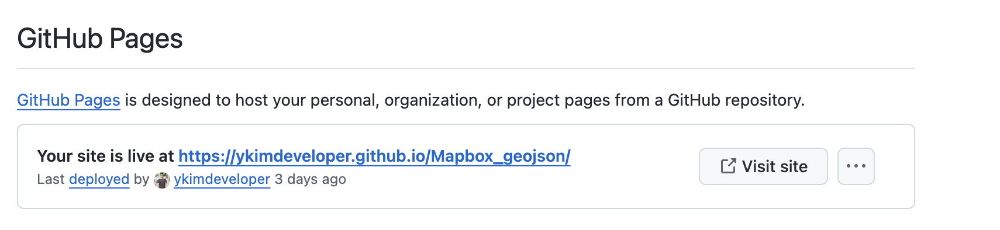
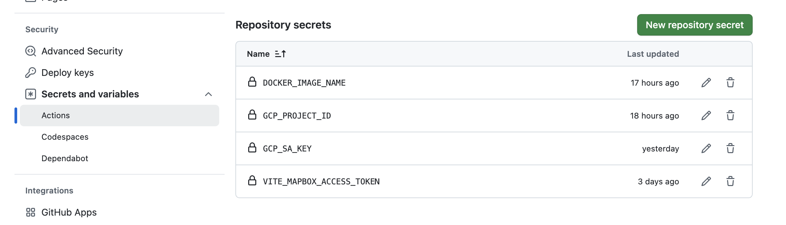
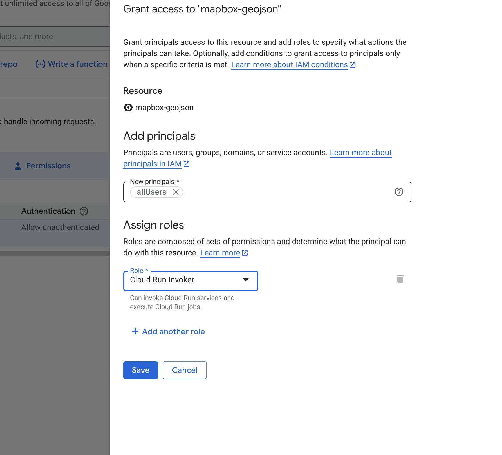
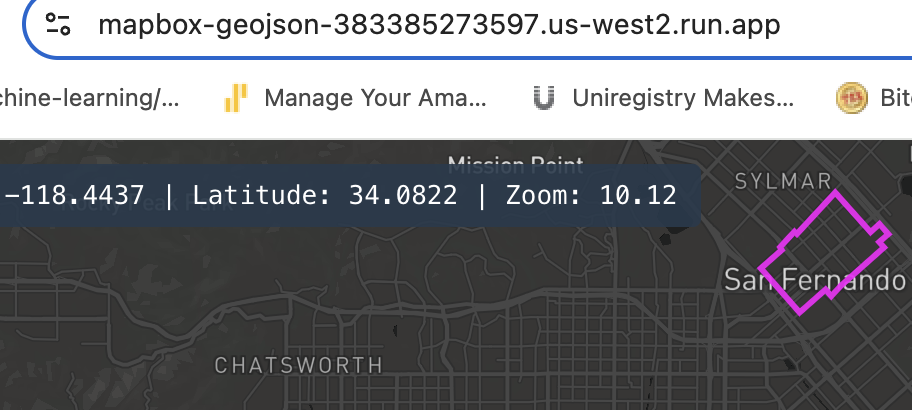

# Mapbox_geojson


Santa Monica boundaries goes into the ocean
https://www.openstreetmap.org/relation/3353288


ArcGis has 3 boundaries at Santa Monica
https://www.arcgis.com/apps/mapviewer/index.html?layers=78251bbda6214e348cb9cf304bbcac98
https://gisdata.santamonica.gov/maps/78251bbda6214e348cb9cf304bbcac98/about


## GeoJSON Files

You can find the GeoJSON files in the [public/data_geojson directory](https://github.com/ykimdeveloper/Mapbox_geojson/tree/main/public/data_geojson).

- [x] Incorporated Cities:
  - [x] West Hollywood
  - [x] Beverly Hills
  - [x] Culver City
  - [x] Santa Monica
  - [x] Universal City
  - [x] San Fernando
  - [x] Inglewood
- [ ] Unincorporated
  - [x] Marina Del Ray
  - [ ] Unincorporated LA Southwest of Culver City (this includes View Park-Windsor Hills, Ladera Heights, and oil fields)
  - [ ] Federal Land (VA Campus)
  - [x] Franklin Canyon (weird square above Beverly Hills)

## project files

App.js Main component that displays the map, sidebar with coordinates, and a reset button. It uses the custom hook to initialize and control the Mapbox map.

src/hooks/useMapbox.js Custom hook that creates and manages the Mapbox map instance, updates state on movement, and loads GeoJSON county layers on map load.

src/utils/countySources.js Utility that exports addCountyLayer, a function to fetch local GeoJSON, optionally wrap it as a Feature, and add it to the map with neon styling.

```Md
project-root/
  ├─ public/
  │   └─ data_geojson/
  │       ├─ bev_hills/
  │       │   └─ bev_hills_openstreetmap.geojson
  │       └─ culver_city/
  │           └─ culver_city_openstreetmap.geojson
  └─ src/
      ├─ hooks/
      │   └─ useMapbox.js
      └─ utils/
          └─ countySources.js
```

# CI/CD

## Deploying to GitHub Pages

1. Update Vite Config: Change the base in vite.config.js to match your repo name

```Md
// For GitHub Pages, if your repository is named "Mapbox_geojson":
export default defineConfig({
  base: '/Mapbox_geojson/',
  plugins: [react()],
})

```

2. Production Build: Run npm run build to generate static files in the dist/ folder.
3. Deploy to GitHub Pages

   ```
   npm run build
   npm install --save-dev gh-pages
   ```
    package.json:
   ```
        "scripts": {
        "build": "vite build",
        "deploy": "gh-pages -d dist"
      }
   ```
4. Your app will then be available at https://<username>.github.io/my-app/
   ```npm run build
      npm run deploy
   ```
   
5. Add secrets
   

## Deploying using GitHub Actions to Google Cloud





