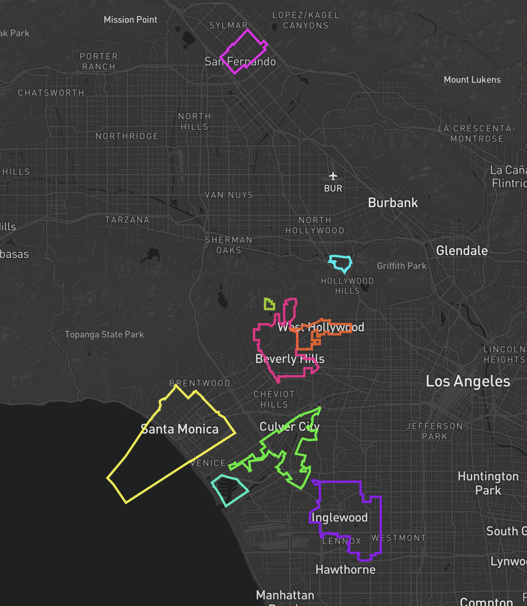
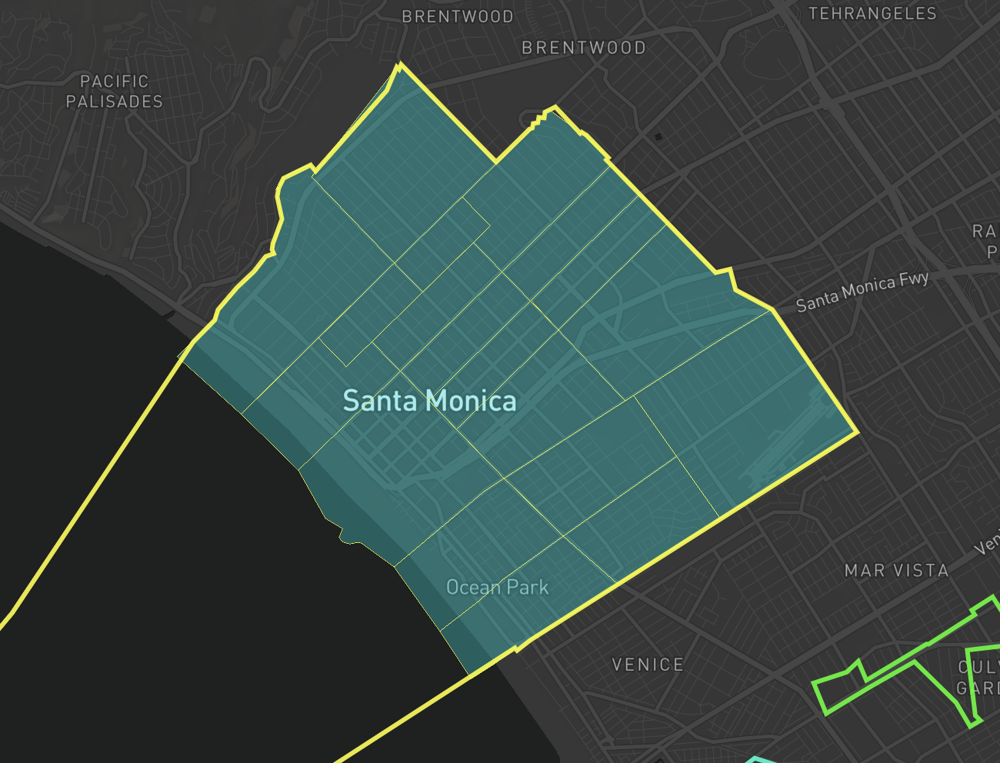
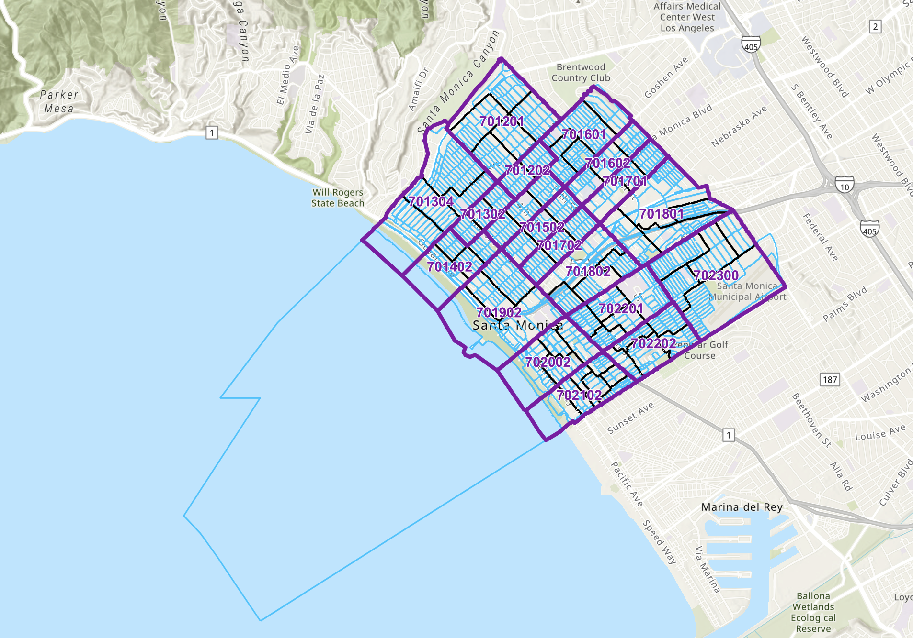

# Mapbox_geojson






Santa Monica boundaries goes into the ocean
https://www.openstreetmap.org/relation/3353288


ArcGis has 3 boundaries at Santa Monica
https://www.arcgis.com/apps/mapviewer/index.html?layers=78251bbda6214e348cb9cf304bbcac98
https://gisdata.santamonica.gov/maps/78251bbda6214e348cb9cf304bbcac98/about



App.js Main component that displays the map, sidebar with coordinates, and a reset button. It uses the custom hook to initialize and control the Mapbox map.

src/hooks/useMapbox.js Custom hook that creates and manages the Mapbox map instance, updates state on movement, and loads GeoJSON county layers on map load.

src/utils/countySources.js Utility that exports addCountyLayer, a function to fetch local GeoJSON, optionally wrap it as a Feature, and add it to the map with neon styling.

```Md
project-root/
  ├─ public/
  │   └─ data_geojson/
  │       ├─ bev_hills/
  │       │   └─ bev_hills_openstreetmap.geojson
  │       └─ culver_city/
  │           └─ culver_city_openstreetmap.geojson
  └─ src/
      ├─ hooks/
      │   └─ useMapbox.js
      └─ utils/
          └─ countySources.js
```


